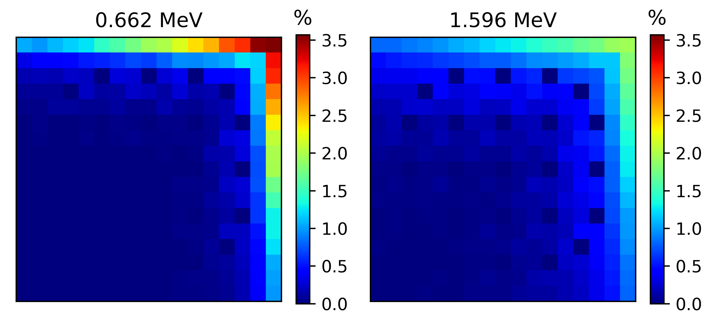
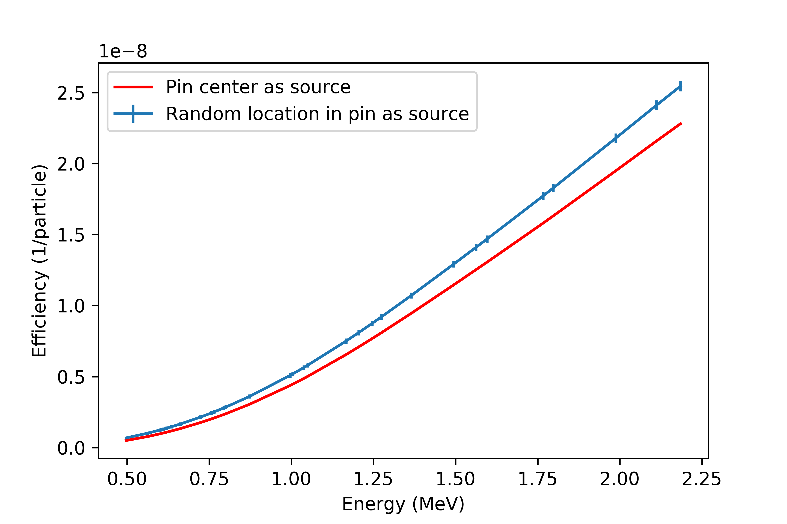

# Summary

The operator declarations of spent nuclear fuel assemblies are routinely verified for nuclear safeguards purposes to ensure their non-diversion and integrity. Many countries consider the possibility of eventually placing the fuel in a geological repository and prior to this it is expected that the fuel assemblies need to be carefully characterized and verified, for instance using gamma spectroscopy measurements. It can be expected that in connection to such activities, verifying parameters such as burnup (ie. the energy outtake from the nuclear fuel), cooling time (ie. the time the fuel spent outside the reactor after operation), initial enrichment (ie. the amount of fissile material in the fuel before operation) and integrity (whether pins inside the assembly have been manipulated) may become an important task of nuclear safeguards inspectors, since discrepancies may indicate unauthorized activities at the facilities. Ideally, the verification should be done with non-destructive assay systems.

Passive gamma spectroscopy provides a robust and relatively simple method to analyze spent fuel since the characteristics of spent nuclear fuel strongly affect the gamma radiation emitted from the fuel [@Janssonthesis]. Lately, passive gamma tomography has also become a possible method to characterize and analyse properties of spent nuclear fuels [@pget]. In both cases, gamma radiation is measured around the fuel assembly from a distance using one or more collimated detectors with spectroscopic capabilities. The detector efficiency, the ratio between number of detected particles and number of particles emitted by the source, of such systems is of great interest. The detector efficiency is the product of the geometric efficiency (probability that emitted particles reach the detector region) and the intrinsic efficiency of the detector (probability that the particles are detected). The detector efficiency is usually estimated with Monte Carlo simulations, most often by using the MCNP particle transport code [@mcnp]. Nevertheless, analog Monte Carlo simulations of spent fuel passive gamma measurements are extremely time consuming. This is because the source (the spent fuel assembly) is both highly radioactive and highly attenuating (made of high-density uranium dioxide), and the strong radiation field around the source often makes it difficult to place it near the detectors. In addition, it is not uncommon to use collimators with narrow slits around the detectors, something that makes the simulation of the detection process even more time consuming. Thus, only a tiny fraction of source particles reach the detector. As a solution, the simulation is often split into two parts: first, a point-detector (F5 in the MCNP convention) tally is used to estimate the energy-resolved gamma photon flux at the location of the detector, and then a subsequent pulse-height tally computation (F8 in the MCNP convention) is done to estimate the detector response. The F5 tally provides a semi-deterministic solution of the transport problem. The history of the gamma-ray is tracked with Monte Carlo, however at each interaction of the particle, the contribution to a point-detector is calculated analytically. A great advantage of this method is that both the direct attenuation of gamma radiation and the build-up factor are included. However, this methodology still requires excessive amount of computing time when the efficiency curves of a large number of assembly configurations are needed, for example when training machine learning algorithms for classification analysis of intact and manipulated fuel assemblies based on the measured gamma spectrum [@elterMVA]. Furthermore, when prototyping with such algorithms, the accuracy of a Monte Carlo code may not be needed. Nevertheless, in collimated passive gamma spectroscopy setups, one could argue that only the uncollided gamma-rays contribute significantly to the gamma peaks in the spectrum (if the background is removed), thus computing the uncollided F5 tally would be satisfactory. However, computing the uncollided point-detector flux does not require a transport code such as MCNP, the task can be solved with a program that feigns to be a transport code such as the one developed here.

# feign

``feign`` is a Python package which implements a 2D point-kernel method to estimate the uncollided point-detector gamma flux around a rectangular spent fuel assembly. It is intended for nuclear safeguards specialists and nuclear engineers who want to get a quick estimate on the geometric efficiency in their passive gamma setup. The package relies on NumPy [@numpy] for data handling and Matplotlib [@matplotlib] for plotting the geometry and the results. The user defines the experimental setup: materials, pin types (consisting of nested annular material regions), assembly lattice, detector locations and optionally collimators and additional absorber elements. Then, the program iterates through each lattice position containing source material and calculates the distance traveled in various materials towards the detector point by a gamma-ray emitted from the given lattice position. Based on the user input, the actual source location is either the center of the pin or a randomly selected location inside the pin (the user then also sets the number of randomly selected locations per pin, in order to estimate the standard deviation of the traveled distances). 

A traveled distance map can be seen in Fig. \ref{fig:distance} for a 17x17 pressurized water reactor (PWR) fuel assembly measured at the passive gamma spectroscopy station of the Swedish Central Interim Storage Facility for Spent Nuclear Fuel (Clab) as described by [@Vaccaro2016]. The detector point is facing the upper right corner. Based on the traveled distance maps and user-provided mass attenuation coefficient data, the program evaluates the probabilities $P_i(E)$ (or point-flux per source particle)

$$P_i(E) =\frac{1}{4\pi R_{i}^2}\prod\limits_m e^{-\mu_m(E) d_{i,m}}$$

that a gamma-ray emitted from position $i$ with energy $E$ hits the detector without collision. $R_i$ is the distance between the source position and the detector, $\mu_m$ is the total attenuation coefficient of material $m$ and $d_{i,m}$ is the distance traveled by a gamma-ray emitted from position $i$ through material $m$. A relative contribution map can be seen in Fig. \ref{fig:contribution} for the same 17x17 assembly. When summing up the contributions made by each pin for each energy, one gets the geometric efficiency curve of the system. Fig. \ref{fig:geomeff} illustrates one case when the source locations are the center of the pins and another case when ten source locations were randomly selected in each pin. One can see that the pin center approximation has a lower efficiency as compared to the case with randomly selected source locations inside the pin. This is due to the fact that assuming all emissions originate from the center of the pin overestimates the traveled distances (thus underestimating the geometric efficiency).

The program includes several approximations, which limit its area of applications. These approximations and the rationale behind them are the following:

- The program is limited to 2D geometries. For a long collimator with a narrow horizontal slit which is placed in front of the detector, the axial dependence is negligible.

- The build-up factor is neglected. If the detector has a high energy-resolution, then it becomes a valid approximation to consider that for a given gamma-peak only photons directly hitting the detector can contribute, and photons participating in scattering reactions will contribute only to the background, which ideally should be removed during the analysis of the spectrum. 

Thus, for typical spent fuel passive gamma spectroscopy setups, ``feign`` will produce a reliable estimate of the geometric efficiency curve. Nevertheless, even where these approximations are not valid, the package can be used as a fast way to estimate the uncollided point flux in order to aid setting up variance reduction methods in Monte Carlo calculations (eg. importance values or weight windows).

# Acknowledgements

The package was developed within a project funded by the Swedish Radiation Safety Authority (SSM), grant number SSM2015-4125. Special thanks to Lajos Nagy for the useful advices on the structure of the geometry module.

# References
