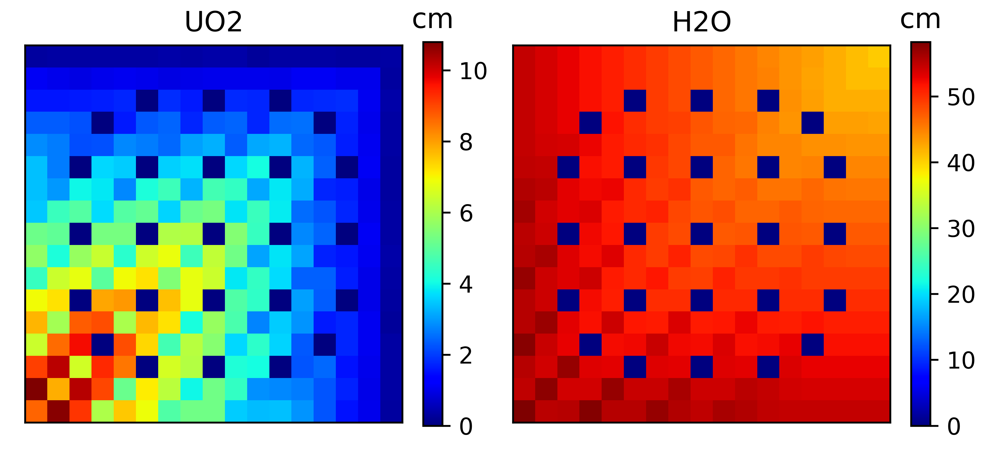

# Summary

The operator declarations of spent nuclear fuel assemblies have to be routinely verified for safety and nuclear safeguards purposes before the assemblies are being placed in copper canisters which are lowered into the geological storage. Verifying parameters such as burnup (ie. the time the fuel spent in the reactor), cooling time (ie. the time the fuel spent outside the reactor after operation), initial enrichment (ie. the amount of fissile material in the fuel before operation) and integrity (whether pins are missing from the assembly) is an important task of nuclear safeguards since a discrepancy in the declared values may indicate unauthorized activities at the facility where the fuel is stored and handled. Ideally, the verification should be done with non-destructive assay systems. 

Passive gamma spectroscopy provides a robust and relatively simple method to analyze spent fuel since the characteristics of spent nuclear fuel strongly affect the gamma radiation emitted from the fuel [@Janssonthesis]. Lately, passive gamma tomography also became a widely accepted tool to characterize spent fuel assemblies [@pget]. In both cases, gamma radiation is measured around the fuel assembly from a distance with one or more collimated detectors which have spectroscopic capabilities. The detector efficiency, the ratio between number of detected particles and number of particles emitted by the source, of such systems is of great interest. The detector efficiency is the product of the geometric efficiency (probability that emitted particles reach the detector region) and the intrinsic efficiency of the detector (probability that the particles are detected).  The detector efficiency is usually estimated with Monte Carlo simulations, most often by using the MCNP particle transport code [@mcnp]. Nevertheless, analog Monte Carlo simulation of spent fuel passive gamma measurements is extremely time consuming, since the source, ie. the fuel assembly is made of high density uranium-dioxide, is located far (often several meters) from the detector and is usually viewed through collimators with narrow slits. Thus, only a tiny fraction of source particles reach the detector. As a solution, the simulation is often split into two parts: first, a point-detector (F5 in the MCNP jargon) tally is used to estimate the energy-resolved gamma photon flux at the location of the detector, and then a subsequent pulse-height (F8 in the MCNP jargon) tally computation is done to estimate the detector response. The F5 tally provides a semi-deterministic solution of the transport problem. The history of the gamma-ray is tracked with Monte Carlo, however at each interaction of the particle the contribution to a point-detector is calculated analytically. A great advantage of this method is that both the direct attenuation of gamma radiation and the build-up factor is included. However, this methodology still requires excessive amount of computing time when the efficiency curves of a large number of assembly configurations are needed, for example when training machine learning algorithms to classify based on the measured gamma spectrum whether a fuel assembly is intact or a number of pins were replaced with dummy pins [@elterphysor]. Furthermore, when prototyping with such algorithms, the accuracy of a Monte Carlo code might not be needed.  Nevertheless, in collimated passive gamma spectroscopy setups, one could argue, that only the uncollided gamma-rays contribute significantly to the gamma peaks in the spectrum (if the background is removed), thus computing the uncollided F5 tally would be satisfactory. And computing the uncollided point-detector flux does not require a transport code, the task can be solved with a program which feigns to be a transport code.

# feign

``feign`` is a Python package which implements a 2D point-kernel method to estimate the uncollided point-detector gamma flux around a rectangular spent fuel assembly. The user defines the experimental setup: materials, pin types (consisting of nested annular material regions), assembly lattice, detector locations and optionally collimators and additional absorber elements. Then, the program iterates through each lattice position containing source material and calculates the distance traveled in various materials towards the detector point by a gamma-ray emitted from the given position. A traveled distance map can be seen in \ref{fig:distance} for a 17x17 PWR assembly measured at the passive gamma spectroscopy station of the Swedish Central Interim Storage Facility for Spent Nuclear Fuel (Clab) as described by [@Vaccaro2016]. Based on the traveled distance maps and user-provided mass attenuation coefficient data, the program evaluates the probability (or point-flux per source particle)

$$\frac{1}{4\pi R_{i}^2}\prod\limits_m e^{-\mu_m(E) d_{i,m}}$$

for each energy _E_ requested by the user that a gamma-ray emitted from position _i_ hits the detector without collision. Where $$R_i$$ is the distance between the position and the detector, $$\mu_m$$ is the total attenuation coefficient of material _m_ and $$d_{i,m}$$ is the distance traveled by a gamma-ray emitted from position _i_ through material _m_. A contribution map can be seen in \ref{fig:contribution} for the same 17x17 assembly. When summing up the contributions made by each pin for each energy, one gets the geometric efficiency of the system, as shown in \ref{fig:geomeff}.

The program includes several approximations, which limits its area of applications. These approximations and the rationale behind them are the following:

- The program is limited to 2D geometries. In case, collimators with a narrow horizontal slit are placed in front of the detector points, the axial dependence is negligible.

- The gamma-ray source locations are considered to be at the middle of the pins. In case, the distance between the detector and the assembly is several order of magnitude larger than the pin diameter, this becomes a reasonable approximation for rectangular lattices.

- The build-up factor is neglected. If the detector has a high energy resolution, then it becomes a valid approximation to consider that for a given gamma-peak only photons directly hitting the detector can contribute, and photons participating in scattering reactions will contribute only to the background, which ideally should be removed during the analysis of the spectrum. 

Thus, for typical spent fuel passive gamma spectroscopy setups ``feign`` will produce a reliable estimate of the geometric efficiency curve. Nevertheless, even where these approximations are not valid, the package can be used as a fast way to estimate the uncollided point flux in order to aid setting up variance reduction methods in Monte Carlo calculations (eg. importance values, or weight windows).

# Acknowledgement

The package was developed within a project funded by the Swedish Radiation Safety Authority (SSM), grant number SSM2015-4125.

# References
